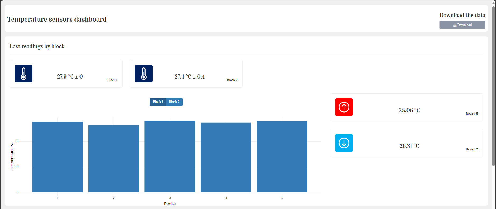
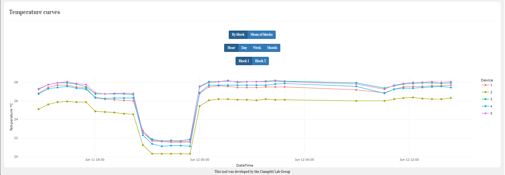

# TempVis

## Contributors

- Gustavo Nocera Santiago ([@GustavoSantiago113](https://github.com/GustavoSantiago113))

## Objective
This is a digital tool developed using R Shiny to display the temperature readings obtained through a [Temperature Datalogger](https://github.com/GustavoSantiago113/Soil_Temperature_Datalogger) and save the data as a .csv file.

## Features

- This tool has a header with a button on the right side that allows the download of the data in .csv file format.
- A block with the last readings of the sensors. The top cards are the mean readings by block with the standard deviation. The graph shows the last readings done by each sensor, with a button to change the block. On the right side, two cards show the maximum and the minimum readings for the block, informing what device read that temperature.



- Lastly, there is the presentation of the historical readings, which can be visualized by block or by the mean within each block. Grouped by hour, day, week or month. And, if selected by block, you can select what block you want to visualize.



## Run the tool

1. Clone this repository on your device.
2. After cloning your device, open the runApp.R file in an IDE that runs the R programming language.
3. Run the lines 2 to 5 to install the required packages.
4. Run line 8 to call the function where the shiny app is.
5. Modify line 8 to fit your needs by changing the arguments of the function. It requires only two arguments.
    - file.source argument is from where your data is coming from: "txt" from the microSD card or "NoSQL" from the remote database.
    - If your data is coming from the microSD card, set the file.path argument to the path of your .txt file.
    - If your data is coming from the remote database, set the GET.API argument to the server URL + "/obtain". This server URL is the HTTP address in which you can access your server.

## Can I use this tool for data not coming from the Temperature Datalogger?
The answer is yes! The only requirement is that the data format.

For data coming from .csv or .txt formats, it must come in the following format:

```csv
Group,Reading,DateTime
1,24.81/24.37/23.87/24.25/24.62/,16/5/2024 15/33,
1,24.44/23.75/23.56/23.69/24.12/,16/5/2024 15/34,
1,24.25/23.50/23.50/23.19/24.00/,16/5/2024 15/35,
1,24.06/23.25/23.44/22.94/23.81/,16/5/2024 15/36,
1,23.94/23.25/23.44/22.75/23.62/,16/5/2024 15/37,
1,23.87/23.19/23.37/22.69/23.56/,16/5/2024 15/38,
1,23.81/23.19/23.31/22.62/23.56/,16/5/2024 15/39,
1,23.81/23.19/23.31/22.62/23.50/,16/5/2024 15/41,
1,23.75/23.12/23.31/22.62/23.44/,16/5/2024 15/42,
1,23.69/23.12/23.25/22.56/23.44/,16/5/2024 15/43,
1,23.69/23.06/23.25/22.56/23.37/,16/5/2024 15/44,
```

For data coming from remote databases, they have to be a JSON with the following format:

```json
  "group": "1",
  "readings": "26.81/25.12/27.25/26.75/27.31/",
  "dateTime": "11/6/2024 14/47",
```

It can have other data too, but the ones listed are mandatory.
